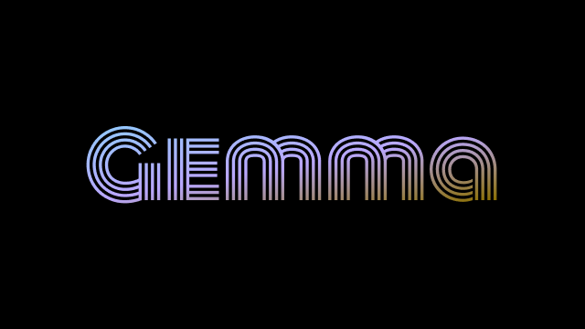

# Getting Started

> _This simple example demonstrates how to use the powerful **[Gemma3](https://ollama.com/library/gemma3)** model from [**Ollama**](https://ollama.com/), seamlessly integrated with the [**AIOGram**](https://aiogram.dev/) Telegram Bot API._

### 1. Clone the Repository

Use `git clone` to download the project:

`git clone [repository link - replace with actual link]`

### 2. Ollama

**Download Ollama**: Get the Ollama client for your operating system:
- [**OS**]()
- [**Docker**]()

**Pull the model**: 
- `ollama pull gemma3:4b`
- Other **_Gemma_** models you can find **[here](https://ollama.com/library/gemma3)**.
- Other models (_not only Gemma_) – [**here**](https://ollama.com/library/)
  - Don't forget to change `MODEL` in `utils.py`

### 3. Development Environment (Choose One)

- PyCharm: Create a new project and set up a virtual environment.

####

- Other Editors:
  - `cd gemma-ai-bot && python3 -m venv .venv`
    - Windows: `.venv\Scripts\activate`
    - MacOS & Linux: `source .venv/bin/activate`

### 4. Install Dependencies

`python3 -m pip install -r requirements.txt`

## Running the Bot

1. **Create a Bot:** First, use [@BotFather]() to create your Telegram bot.
2. **Get Your Token:** Obtain the bot's token.
3. **Configure:** Paste the bot token into the `TOKEN` variable in `config.py`.
4. **Start the Bot:** `python3 bot.py`